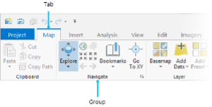

  
```{r setup, include=FALSE}
knitr::opts_knit$set(base.dir = "./labs/", root.dir = "./labs/")
knitr::opts_chunk$set(echo = TRUE, eval = FALSE)
```
---

**Due Date:**

**Instructor: Xiaozhong Sun (xs243@cornell.edu)**

**Lab TAs:**

**Location: Sibley 305, Barclay Gibbs Jones Computer Lab**

**Total Points:**

---

## Goals for this lab

If you've never used ArcGIS, today's lab session will take you to familiarize yourself with it. People's learning curve for new software can vary from person to person. But most people tend to feel more or less frustrated when new to the software, and I am no exception. What I'm trying to say is that there's probably no quick way to learn it. All you can do is use it as much as possible, get familiar with it, and don't worry if you find yourself starting slow. We'll have a semester to do that.

In today's lab session, you will 1) learn the basic functions and windows layout (layers/panes) of ArcGIS Pro; 2) you will start to make a map. By the end of this lab session, you should be able to **_create folders/projects, add data, create a unique layer map, put together a map layout, use some of the primary analysis tools in Arc Pro, and save your project_**. 

---

## Know your data

Take a look at your lab data. We don't have too many data stored locally for our lab 1. Currently there are only six files with the same name, which represent polling places for Tompkins County (we will be adding more data later during this lab). Look at how the files are listed and organized. This is normally the file format supported by software such as ArcGIS and QGIS. This one layer of data is comprised of a number of files: a .shp file (shape file) and other support files: .sbn, .sbx, .shx, .prj (this one defines the projection) and .dbf (the last one contains the attribute information).**[Hint: google these files' suffix and get to know what they are. Google is always a good place to start when you stack or curious!!]**

---

## Create a project

You will notice that you have the option of opening a recent project or template. As we have not created a project, on the opening page, please click on the **Map** option under **Blank Templates**.

The **Create a new project** dialog box opens. Give your project a name (e.g., “Lab 1”), and navigate to your lab_1 folder. Uncheck the **'Create a new folder for this project'** box and click OK.

Above the map view is the **ribbon (where magic happens)**. The ribbon has a set of core tabs: **Map, Insert, Analysis, View, Edit, Imagery, and Share** that are always present when a map view is active. Each tab has its own set of tools, organized in groups. The **Map** tab has tools for interacting with the map. On the **Map** tab, the **Explore** tool is located in the Navigate group. 

<left></left>

For example, the **Explore** tool allows you to move around the map and to read information about map features of interest. Under the Map tab, the Navigate tool bar has a number of tools you should familiarize yourself with,
The Full extent tool  allows you to zoom out to the full extent of the dataset (the blue arrow below it brings you back to your previous extent.   allow you to zoom in and out. 
 
Hover over the Explore tool  . A pop-up image shows the mouse button navigation functions and some common keyboard shortcuts.
Hover over the map and move the mouse pointer. The latitude-longitude coordinates of the mouse pointer's location are displayed at the bottom of the map view. Use the mouse wheel to zoom in and out. 


In addition, you may see a Contents pane, a Catalog pane, or both. Panes are additional windows that ArcGIS help you manage views and projects. They are basically separate interfaces offer you access to specific functionality of the software. 

They are very important and sometimes need to be kept open all the time. Panes in ArcGIS are very flexible, you can open, close, move, dock and hide them based on your preferences. You can always play around them yourself. 

<left></left>

When you accidentally close them, you can go to **View** -> **Windows** and you can turn on the them again. Noticing there are more panes to come, we will get to know them later in our course!!

As you work, you'll often open and close panes that you need for specific tasks. You may also want to re-position panes or minimize them to make room for maps and other views. On the ribbon, click the **View** tab. In the **Windows** group, click **Reset Panes** and click **Reset Panes for Mapping (Default)**. And voilà, they will be back to default look.

The two panes can be docked on either sides of the ArcGIS Pro window. They can also stacked on top of the other. If the panes are stacked, they have tabs at the bottom that allow you to switch from one pane to the other. You can also autohide a pane by clicking the <left></left>on the top-right corner so it doesn't take up space when you aren't using it.

The **Contents** pane lists items in the active view, such as layers in a map or layout elements in a layout. The **Catalog** pane lists items that belong to the project, such as databases, toolboxes, and folder connections. The **Catalog** pane also provides access to portal items, such as web layers.


---

## Add a basemap

You noticed that a Topographic layer was automatically added when you opened the project. If it doesn’t match your taste or is too cluttered, you can adjust the base map. 

ArcGIS Pro provides different Basemaps in addition to the default World Topographic Map. 

Go to Map ribbon, under Layer tab, click Basemap. In the Add Basemap dialogue box, you have a number of options. Select one you preferred.

Under the Map tab, use the Locate tool to find Ithaca, NY.

---

## Add data

---

## Save project

---

## Create a map layout

---

## Now it's your turn!

<br>
<br>

**The END**