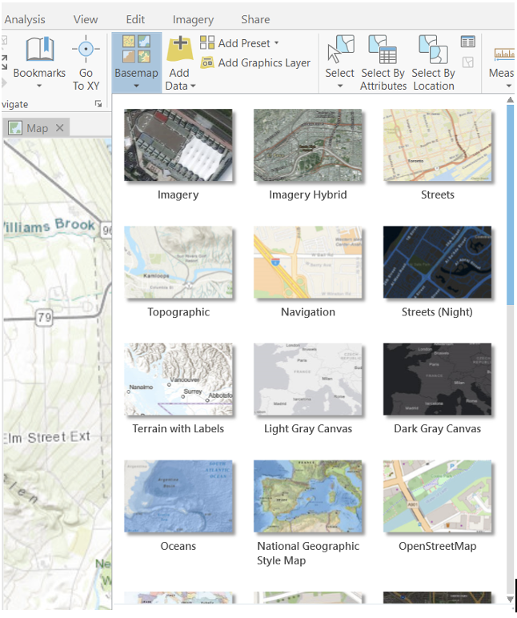
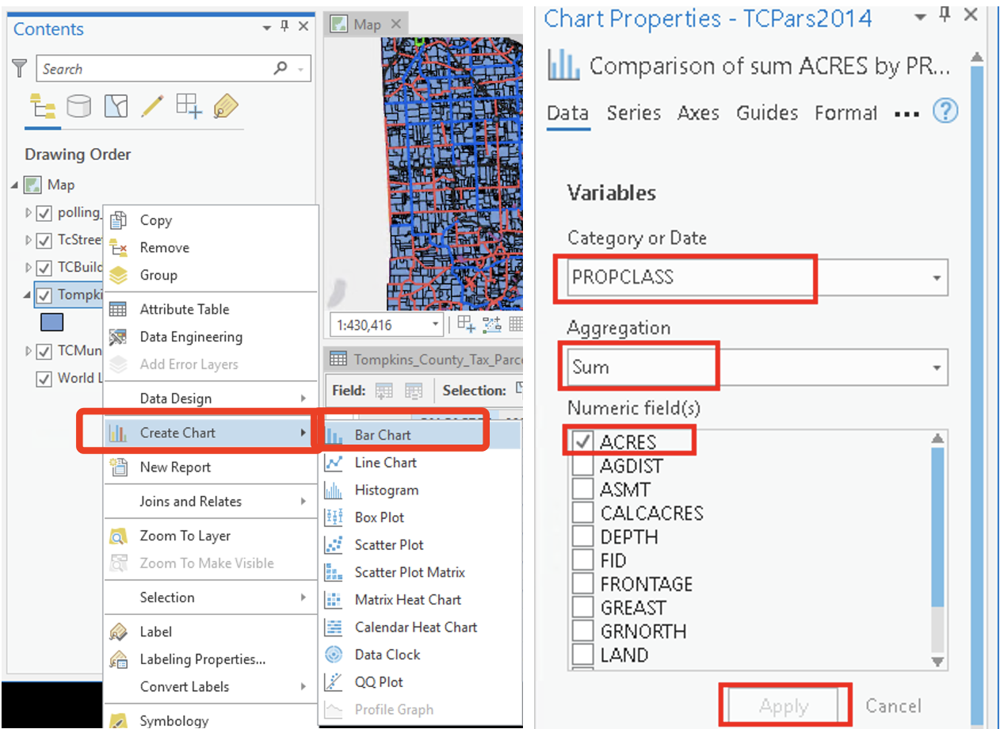
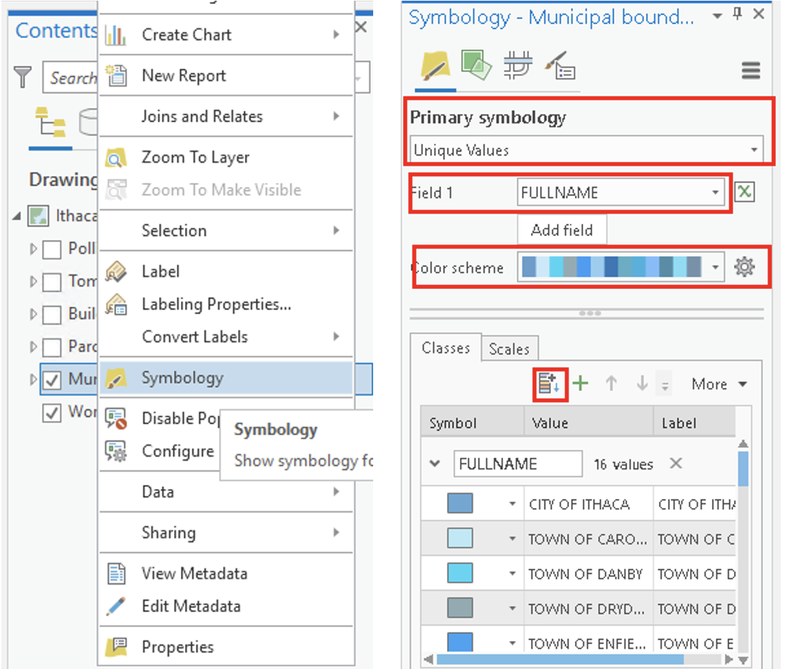
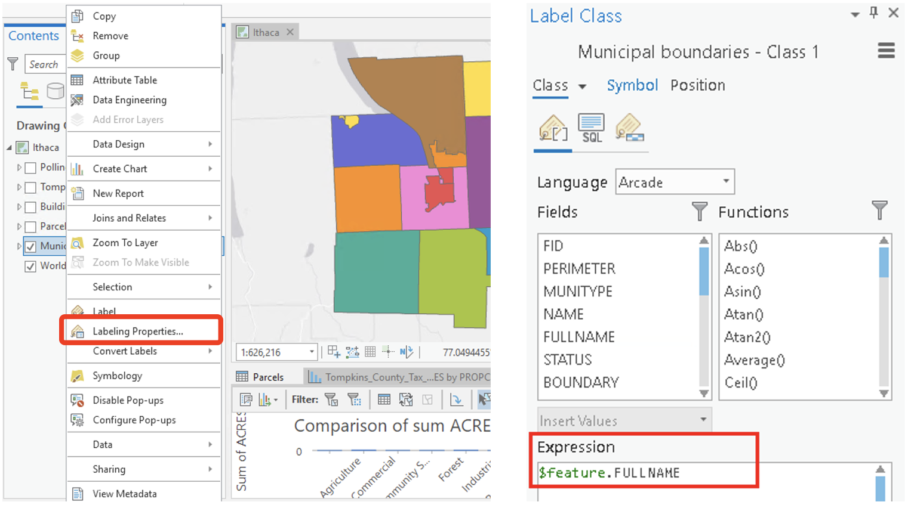
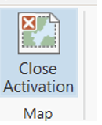
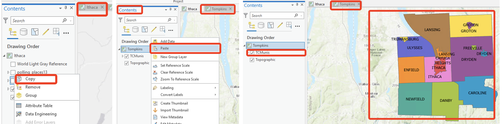
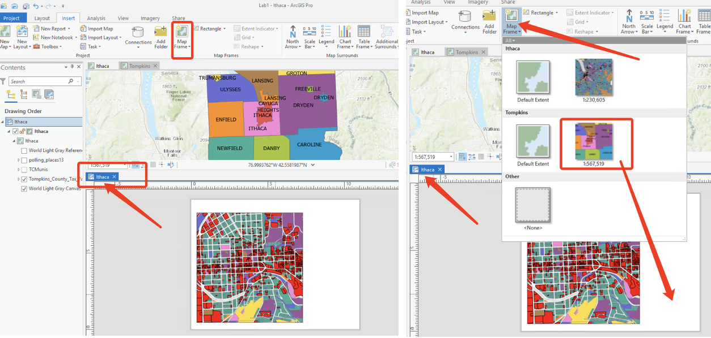
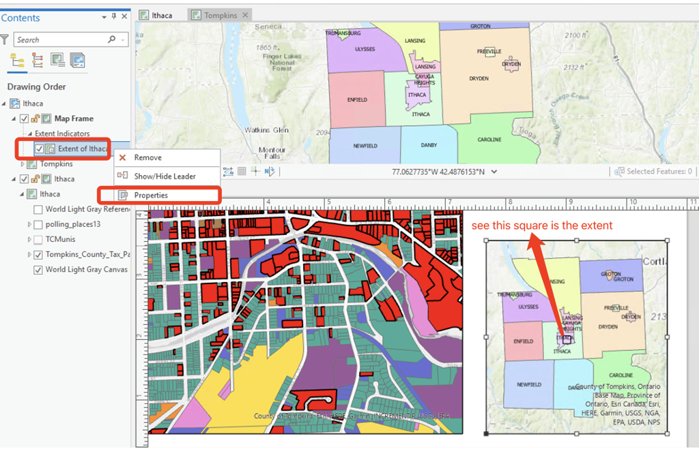
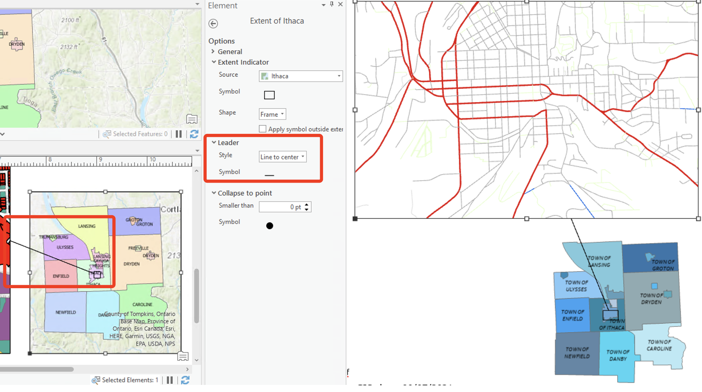

  
```{r setup, include=FALSE}
knitr::opts_knit$set(base.dir = "./labs/", root.dir = "./labs/")
knitr::opts_chunk$set(echo = TRUE, eval = FALSE)
```
---

**Due Date:**

**Instructor: Xiaozhong Sun (xs243@cornell.edu)**

**Lab TAs:**

**Location: Sibley 305, Barclay Gibbs Jones Computer Lab**

**Total Points:**

---

## Goals for this lab

If you've never used ArcGIS, today's lab session will take you to familiarize yourself with it. The latest ArcGIS Pro has a very similar interface to software of Microsoft Office. They all have **ribbon-based** interfaces. 

People's learning curve for new software can vary from person to person. But most people tend to feel more or less frustrated when new to the software, and I am no exception. What I'm trying to say is that there's probably no quick way to learn it. All you can do is use it as much as possible, get familiar with it, and don't worry if you find yourself starting slow. We'll have a semester to do that.

In today's lab session, you will 1) learn the basic functions and windows layout (layers/panes) of ArcGIS Pro; 2) you will start to make a map. By the end of this lab session, you should be able to

1. **create folders/projects;**
2. **add data;**
3. **create a unique layer map;**
4. **put together a map layout;**
5. **use some of the primary analysis tools in Arc Pro;**
6. **and save your project.**

---

## Know your data

Take a look at your lab data. We don't have too many data stored locally for our lab 1. Currently there are only six files with the same name, which represent polling places for Tompkins County (we will be adding more data later during this lab). Look at how the files are listed and organized. This is normally the file format supported by software such as ArcGIS and QGIS. This one layer of data is comprised of a number of files: a .shp file (shape file) and other support files: .sbn, .sbx, .shx, .prj (this one defines the projection) and .dbf (the last one contains the attribute information).**[Hint: google these files' suffix and get to know what they are. Google is always a good place to start when you stack or curious!!]**

---

## Create a project

You will notice that you have the option of opening a recent project or template. As we have not created a project, on the opening page, please click on the **Map** option under **Blank Templates**.

The **Create a new project** dialog box opens. Give your project a name (e.g., “Lab 1”), and navigate to your lab_1 folder. Uncheck the **'Create a new folder for this project'** box and click OK.

---

## Save your project

Know how to save your project is a good habit to get into early. Under the **Project** tab, you can save your project. ArcGIS Pro uses *.aprx as its default project file type. Remember to save your project along the way!!!

ArcGIS Pro adopts project-based workflow like other development software. A [**Project**](https://pro.arcgis.com/en/pro-app/2.8/help/projects/what-is-a-project.htm) in ArcGIS is a set of ArcGIS geographic and database files that have been saved in a certain organized form. It is a pointer to the locations of the actual files – it contains no real data, only file mapping information! You are not re-saving and changing any of the data in the map. This means if you move your data from one place to another, your project will lost its connection! If you were to copy the project file, you would merely be copying the “pointers”, NOT the actual data.  

Therefore, it is important for you, from now on, to save all relevant data from the course folder to a (well labeled) folder you have created on your drive or cloud. Most importantly, create and save your project file within that same folder. 

If you edit or change any data file (for example: changed the name of the data in folder or moved them to other directories) related to a exiting project, once you reopen that project, the data you change might affect displaying the layers/data in maps. Your current project connection to the corresponding data is invalid. You have to rebuild the connection to restore the saved progress. See this detailed instruction on how to [**repair project items**](https://pro.arcgis.com/en/pro-app/2.8/help/projects/repair-project-items.htm).

---

## Introduction to the interface

Above the map view is the **ribbon (where magic happens)**. The ribbon has a set of core tabs: **Map, Insert, Analysis, View, Edit, Imagery, and Share** that are always present when a map view is active. Each tab has its own set of tools, organized in groups. The **Map** tab has tools for interacting with the map. For example, under the **Map** tab, the **Explore** tool is located in the Navigate group. 

<left></left>

Specifically, the **Explore** tool allows you to move around the map and to read information about map features of interest. You can familiarize yourself with these tools by simply hovering over these buttons. For example, **The Full extent tool** allows you to zoom out to the full extent of your dataset, **the blue arrow** below it brings you back to your previous extent. 

Instead of using ribbon button, under the **Map** view, you can also use your mouse to move around map view or gather information such as the latitude-longitude coordinates (the mouse pointer's location are displayed at the bottom of the map view). You can also use the mouse wheel to zoom in and out. 

In addition, you may see a Contents pane, a Catalog pane, or both. Panes are additional windows that ArcGIS help you manage views and projects. They are basically separate interfaces offer you access to specific functionality of the software. 

They are very important and sometimes need to be kept open all the time. Panes in ArcGIS are very flexible, you can open, close, move, dock and hide them based on your preferences. You can always play around them yourself. 

<left></left>

When you accidentally close them, you can go to **View** -> **Windows** and you can turn on the them again. Noticing there are more panes to come, we will get to know them later in our course!!

As you work, you'll often open and close panes that you need for specific tasks. You may also want to re-position panes or minimize them to make room for maps and other views. On the ribbon, click the **View** tab. In the **Windows** group, click **Reset Panes** and click **Reset Panes for Mapping (Default)**. And voilà, they will be back to default look.

The two panes can be docked on either sides of the ArcGIS Pro window. They can also stacked on top of the other. If the panes are stacked, they have tabs at the bottom that allow you to switch from one pane to the other. You can also autohide a pane by clicking the <left></left>on the top-right corner so it doesn't take up space when you aren't using it.

The **Contents** pane lists items in the active view, such as layers in a map or layout elements in a layout. The **Catalog** pane lists items that belong to the project, such as databases, toolboxes, and folder connections. The **Catalog** pane also provides access to portal items, such as web layers.

---

## Some basic tools under Map tab

<br>

### Add basemap

You noticed that a Topographic layer was automatically added when you opened the project. If it doesn’t match your taste or is too cluttered, you can either change or close the base map. ArcGIS Pro provides different Basemaps in addition to the default World Topographic Map. 

Simply go to **Map** tab, under **Layer** group, click **Basemap**. In the **Add Basemap** dialogue box, you have a number of options. Select one you preferred.

<left></left>

<br>

### Find location

ArcGIS Pro allows you to locate a place within the basemap. It functions like a Google map. Simply under the **Map** tab, go to **Inquiry** group, use the **Locate** tool<left></left>and put in Ithaca, NY.

<br>

### __*Add data*__

Adding data is an important step for our lab. There are two ways to add data in ArcGIS Pro: local data and online data. The new ArcGIS Pro is integrated with ArcGIS online, a cloud-based tool that users can upload datasets to, which makes it more powerful. You can search and add data that is uploaded and maintained by other users in the ArcGIS cloud.

To add an ArcGIS online portal connection, complete the following steps:

1. Click the **Project** tab on the ribbon and click the **Portals** page. You can also access the **Portals** page from the **Manage Portals** link in the **Sign In** menu.
2. Click **Add Portal**. Enter the URL for the portal on the **Add Portal** dialog box: https://cugis.maps.arcgis.com and click OK.
3. Optionally sign in to the portal. Click the **Options**<left></left> button or right-click the **portal** and click Sign in. Enter your Cornell username and password.
4. You can also sign in portal using [web browsers](https://pro.arcgis.com/en/pro-app/2.8/help/projects/sign-in-to-your-organization.htm#ESRI_SECTION1_1CAD4AEC94E54C1BA236F5CB2DC197D0).

To make the new connection your active portal, right-click the URL and click **Set As Active Portal**. Now, you are ready to add data online. Back in the map: On the **Map tab-Layer group**, click **Add Data** and click **Data**. In the Add Data dialog box, select **ArcGIS Online**.

Now let's add a few data from **ArcGIS Online**. In the search ArcGIS Online box, lets search for 

*	Tompkins County parcel (Tompkins county tax parcels);
* TCBuildings (Tompkins county Building footprints); 
* TcStreets (Tompkins county streets); 
* TCMunis (Tompkins county municipal boundaries).

The search allows for fuzzy matching, the name might not be exactly the same, but choose the one with the latest date. Also pay attention to the owner, data is more credible if it is provided by government agency.

Now, let's add the data from your *local drive*. Navigate to your drive under **Project/Folders** and add the data from your Lab_1 folder for - polling_places13 - polling locations

---

## Basic layers/data editing

<br>

### Layers display on the **Contents pane**

<br>

#### change display order

Note that the **Contents pane** includes several options of displaying layers: List by **Drawing Order or Source** etc. You are able to turn the various “layers” on and off, as well as rearrange the order in which they are presented by “clicking” and “dragging” the layers. When you drag layers, a black line appears just above the layer you are about to move. Move this line until you reach the new position for the layer and let go of the mouse button to drop the layer there. 

*Now let's	rearrange the order of layers from the top to the bottom as polling_places13, TcStreets, TCBuildings, Parcels, and TCMunis.*

<br>

#### rename layers

The current names are not particularly helpful. Let’s change layer name so they are understandable (note: sometimes you may have to open the attribute table and look for clues to determine what a more appropriate title should be).

* First, give our Map a name. In the Contents pane, right click on the Map and go to Map properties. Under the General tab, change the name to ‘Ithaca’. Click OK. (Or simply left click it.)
* Right click on “TcStreets” layer and select **Properties**. In the Layer **Properties** dialog box, select the **General** tab. 
* Under **Name** type “Tompkins County Roads” and hit OK. 
* Change so the others read as follows (or whatever you like):
  *	TCBuildings:  Building footprints
  * TCMunis:  Municipal boundaries
  *	polling_places13: Polling locations	
  *	TcStreets: Tompkins County roads 
  *	taxparcelsrps: Tompkins County Tax Parcels

Remember that you are not really changing the name of the original layer files, only the name displayed in ArcGIS Pro.

<br>

### **The attribute table**

By right clicking on our tax parchel layer in the **Contents** pane, you can access the attribute table (check other functions/shortcuts under the right clicking drop-down menu). A table view opens with the parcels layer attributes, which will contain the attribute information about this layer.  
 
The attribute table is a spread sheet file in which rows represent observations/cases and columns represent variables/attributes. Or to put it differently, the rows correspond to features (in this case polygons that correspond to parcels) and the columns correspond to the attributes of these spatial features. There is a one-to-one link between the features in the map and the rows in the table. This allows users to retrieve attribute information about any feature in the map. It also allows users to display one or more attributes for each geographic feature and easily create maps of particular attributes. 

The first column in the attribute table (FID) is a Feature ID, which assigns a unique number to each feature, starting from zero. The FID is assigned automatically by the GIS system and cannot be changed. 

The last column in the attribute table shows the type of feature (in this case polygons). Any given shapefile can only hold one type of feature (i.e. points, lines or polygons) and cannot combine different feature types.

The other columns all contain various attribute information. Some of these are recognizable, while others are probably not, and will require an examination of the metadata to determine what they represent. 

Now, let's do some statistics.

Right click on the **“Calcacres”** column heading and go to **Statistics.** This will display a basic frequency distribution of parcel size. The output is not particularly helpful. Now let's go back and right click on the layer of tax parcels and go to drop down menu of **Create Chart/Create Bar chart**. Under the **properties**, select **PROPCLASS** as the **Category or Date**, **SUM** as the **Aggregation**, and **ACRES** as the **Numeric fields**. Click “Apply.” This produces a more useful chart of acreage according to the property class. We could then export this chart as an image file using the **Export** button.

<left></left>

---

## Basic Mapping

<br>

### Mapping symbology and label

<br>

#### Symbology
Turn off all layer except for Municipal boundaries. Right click on Municipal boundaries layer and take a look at the attribute table. Note that while each municipality has a Name, these are often duplicate and contingent on the **‘MUNITYPE’** (City of Ithaca, Town of Ithaca, etc.). The attribute **'FULLNAME’** will give us a unique name for each polygon. 

Close the table, right click again and click on **Symbology** which will open the **Symbology** panel. Let's create a ‘unique values’ map using the attribute **'FULLNAME’**.
Under **Primary symbology**, go to unique values. For **Field 1** choose **'FULLNAME’**, then click the **add all values button**<left></left>. ArcGIS assigns colors according to the **Color scheme** that is currently selected.  If you click on the down arrow for **Color scheme**, you will find many other choices. Select one of your choices.

If you want to edit a particular feature (for example a particular polygon), you can double-click on it. For example, you can double click on ‘City of Ithaca’ and change its color (Note that the symbol selector also includes pattern symbols in addition to solid colors).

<left></left>

<br>

#### Adjusting Symbology

Let's adjusting the symbology of other features. Right click on the Polling Locations, and select **Symbology**.	Change the points to stars (note that you can adjust the color and size as well).

<left></left>

You will note that several of the layers from ArcGIS online were added with their symbology already classified. For example, streets are already classified according to the Maintenance variable, and Buildings are categorized according to type (BTYPE).

Right click on the Parcels layer and go to symbology. In the symbology dialog box, select ‘unique values’ as the primary symbology, ‘PROPCLASS’ as the field. We now have created a unique value map of parcels categorized according to property type.

Please see here for an extensive tutorial on [Symbology](https://pro.arcgis.com/en/pro-app/latest/get-started/symbolize-your-data.htm) in ArcGIS Pro.

<br>

#### Creating Labels

Close the **Symbology** pane. Again, right click on the municipalities layer in the Contents and go to the **Labeling** properties. In the **Label** class pane, notice the default attribute (‘Name’) under the **Expression box**. Delete this and identify **‘FULLNAME'** as the appropriate field (this will specify to Arc which attributes to use for the labels). Note that within this dialog box you can adjust the label style and placement properties of the labels. Click Apply. Back in the contents pane, right click on the municipalities layer, and click **Label** – the name of each municipality will now appear in the map. 

<left></left>

You have now created a unique value map for Tompkins County municipalities.
Click here for extensive tutorial on [Labels](https://pro.arcgis.com/en/pro-app/latest/get-started/label-your-map.htm) in ArcGIS Pro.


<br>

### **Mapping layouts**

Now we will come to the final steps of mapping. We will now create a map layout. For this layout, we will include a zoomed view of downtown Ithaca that displays streets, parcels, and polling locations with a context map of Tompkins County that has all the municipal boundaries labeled with municipal names included. 

**Most importantly, these are the basic elements you should include to your map layout every time you create a map!!!**

1. Title (and sub-titles if necessary)
2. Legend (Is it legible? Does it make sense? Are the titles coherent? Do the number breaks make sense?)
3. Metadata/notes (tell us about the map! Who created it? Where? Date? What is the data source? Projection? Units? How is the data classified? What is the purpose of the map?)
4. Scale bar (Do units (feet, miles), breaks (not too many!) make sense?)
5. A north arrow

Now, let's get our "hands dirty".

<br>

#### Creating a layout. 

The first step in making a page layout is to insert a blank layout. On the ribbon, click the **Insert** tab. In the **Project** group, click New Layout to show page size and orientation options. Under **ANSI - Portrait**, click **Letter** (this is a matter of preference). A new, blank layout view opens. 

<left></left>

Let's give the layout a name. In the Contents pane of **layout view**, right-click **Layout** and click **Properties.** On the Layout Properties dialog box, change the name from Layout to ‘Ithaca’.

Now let us create a map frame in our layout. Under the **Insert** tab, click the **Map Frame** drop-down arrow. Select the frame with your data (usually not the first one, the first one is the default). Use your mouse to draw a large rectangle on the layout page. The map frame is added to the layout. It is currently selected, as indicated by selection handles. This will allow us to move it around the page to position it correctly. 

<left></left>

Right click inside the frame and select **Activate** (this can also be accessed through the Layout Tab at the top as well). This will allow you to manipulate the map data within the layout frame and select the correct size and position for your data.

<left></left>

In the Contents pane, right-click Map Frame and click **Properties**. In the Map Frame **Properties** dialog box, click the **General** tab if necessary. Change the name to ‘Ithaca’. Notice at the top, we can toggle between the **layout view and the map view**: 
 
In the layout view, Zoom in to the downtown area by using mouse wheel (remember you have to have the map frame activated. The symbology of the polling places should be red stars. The symbology of the streets should be a single symbol. The symbology of the parcels should be categorized according to property class.(What we have done before)

To close an activation session to avoid unintended changes, go to **Activated Map Frame Layout tab**, click on the **close activation**<left></left>
 at the top left. 

<br>

#### Add a second map frame (context map)

Let's create a context map. Under the **insert** tab, add a new map. Note that insert a map, not a layout frame!!! In the **Contents pane**, under Drawing Order, right-click **Map** and click **Properties**. In the Map **Properties** dialog box, click the **General** tab if necessary. Change the name to ‘Tompkins County’.

<left></left>

This time, add only the Municipal boundaries layer to this map frame. You can do it like this:

*	Go to Ithaca map, right click on the Municipal boundaries layer
* Select “Copy”
* Go to Tompkins map, right click and select paste 

<left></left>

Re-title the layer and create labels for their full names (feel free to experiment with placement and stylistic considerations). 

Now, add a second “Map Frame” to your Ithaca layout to display the Tompkins County map (To do this, you need to de-activate your previous layout session, follow the steps we showed in the previous part, *think through it yourself*.)

<left></left>
   
Within the **contents pane** of layout view, rename this second Map frame ‘Tompkins County’. 

Adding data frames is useful if you wish to include overview/context maps, or to display maps of different variables in the same layout (e.g. for a poster presentation). You can individually adjust each of the map frames on the page. To do that remember to **activate and de-activate** different map frames.

<br>

#### Add map extent indicator

Let us include a extent indicator to indicate the relationship between the two map frames.

On the **Insert** tab click the **Extent Indicator** drop-down arrow and click Ithaca. In this case, you must first click the Map Frame of Tompkins County in order to choose Ithaca in the Extent Indicator. (You must be clear what kind of relationship you want to indicate among these maps! In this case, the relation is containing.)  

Open (right click) the **properties** for **the Extent of Ithaca** and the **Format Extent Indicator pane** appears.

<left></left>

In the Format Extent Indicator pane, you can select an appropriate symbol for the extent map. Under **Extent Indicator**, check the **Apply Symbol outside extent tab**, and for **Leader** style select “**Line to center**”. You will find a line linking between the source map frame and the extent indicator.  

<left></left>

<br>

#### Add map layout elements

You'll add a legend, north arrow, and scale bar to the layout. The legend explains the map's symbology. The north arrow and scale bar provide geographic context.
Legends: 
Note: Before inserting a legend, spaces and any extraneous or unnecessary symbols or icons should be removed. You will also want to take this opportunity to delete unnecessary elements (for example, parcels contain a field for ‘All other values”, which is not particularly useful in a legend. Open the symbology for the parcels layer, and adjust (i.e., delete) both the symbology and the text for this category.
The legend should include the property classes, streets, and polling places

General notes on Legends: 
The legends below are for a map of household median income based on census data. Think about all the ways in which the legend on the left, which is what you get by accepting the ArcGIS defaults, is hard to understand. The bottom line: DO not create a map with a legend that looks like the one on the left!

Under the Insert tab, click Legend  . 
To work with the properties of the legend as a whole, right-click the Legend heading in the Contents pane and click Properties. Alternatively, right-click the selected legend on the layout). We are interested in displaying a legend for the ‘Ithaca’ map frame (not Tompkins County). Try cleaning up the legend so that only the most important information is showing.  

Note: If you fail to clean the legend, you can convert the legend to a graphic and manipulate the legend independently.  you should only use this function if the tools in legend properties window are not sufficient. Once you convert your legend to a graphic it is no longer connected to the data, which means the legend will no longer reflect changes you make on your map, e.g., it will not add new layers or reflect changes in colors. 

1. Move the legend off the map. 
2. Right Click on the legend and choose Convert to Graphics. 
3. Right Click on the legend and choose Ungroup. You now can move and edit all of the elements of the legend independently. 
4. When you are done with your edits, click the mouse and drag a rectangle over all of the elements of your legend to highlight all of them. Right click and choose Group. 

You can add background colors to your data frame – right click on the data frame within the table of contents and go to Properties/Frame – select a background or border of your choice 

Scale Bars: 
A word on scale bars:

 

•	The first scale bar above is what ArcGIS gave as the default after we inserted a scale and did nothing else. It shows quite arbitrary numbers, e.g., 2,350 and 4,700, which are not acceptable.   
•	The second scale bar reflects the fact that we specified that the distance units be in miles, because for distances over a mile, it is easier to understand miles than feet (same with meters and kilometers). But again, the numbers are quite arbitrary.
•	The last scale bar is in miles AND it is easy to read and to use as a measure on the map because it uses whole numbers and has easily understandable divisions of whole numbers (0.25, 0.5, 0.75). This was done easily by simply stretching out the scale bar manually until it said 2 miles (alternatively we could have compressed it to 1 mile) 

The bottom line is – NEVER simply accept the default if it is not easy to read and to use! Take control over your scale bar!
Now insert a scale bar: There are many options. I chose the simplest, but feel free to find one that works for you.
Place the scale bar, notice that the default may not be the most intuitive!
We can grab the end and extend the scale bar so that it includes more obvious break points.
 
Still a bit cluttered for my taste (0.13 miles is not an intuitive distance!) In the format scale bar pane, reduce the number of divisions from 2 to 1. Also note that we can adjust the map units as well as the map frame (Tompkins County is merely the context, so no need to create a scale bar). The downtown Ithaca map frame is important one here. For the downtown Ithaca map, feet may be appropriate. For the Tompkins County data frame, miles may be appropriate.
Much better in my opinion!

6.5 Insert text
Next, you'll add a map title and some descriptive text. On the Insert tab, in the Graphics and Text group, click the Rectangle text tool  . On the layout, above the map frame, draw a rectangle for your map title.
When you release the mouse button, the word Text appears inside an outline of the box. The text is highlighted so you can start to edit it.
In the Format text panel, edit the font size, style and color (Under text symbol/properties) Alternatively, On the ribbon, under Text, click the Format tab. Adjust the font, style and size appropriately.
 
Change Text Format under Ribbon
 
Editing Text Format Under text symbol/properties
Add an appropriate title (short, concise, direct) and sub-title (if necessary). When you're finished, click an empty area on the layout. The text element is now selected on the layout.
It also typical to include a text box with name, date, data source and projection information, as well as other pertinent information. For now, name and date are fine. 

Insert a north arrow (personally I prefer one with clean, modern lines, but that’s just me!), size and place on layout accordingly.

<br>

#### Export the layout

Now that your layout is finished, you can print it or export it to a file that can be easily shared. On the ribbon, click the Share tab. In the Export group, click Layout  .
The Export Layout pane appears. On the Properties tab, change File Type to PNG, JPEG or TIFF necessary.
In the Name box type Lab 1 or something similar. Click Browse   and browse to the location where you want to save the file.
At the bottom of the pane, click Export.
When the export is completed, click View exported file at the bottom of the pane.
The file opens in your default image viewing application. If you want to print the layout, on the Share tab, in the Print group, click Layout  . You may need to change some printer settings, such as the page orientation, before you send the layout to the printer.

---

## Now it's your turn!!!

The first assignment includes two parts:

#### **Part One: Making Maps** (60 pts)
1.	A clean, well-organized map depicting parcels classified according to **property class**, **polling places** and **streets** for **downtown Ithaca**, plus a **location map depicting municipalities for Tompkins County** (i.e., the map we just produced). Make sure you include north arrow, scale bar, title, and text box with name, and date. 15 points
2.	Create a unique value map of all parcels in Tompkins County categorized by **School District**. Include roads and change the symbology so the **state routes** (NYS DOT) stand out. Since we are including all of Tompkins County, no need for a context map. 15 points
3.	Create a unique values map of Downtown Ithaca buildings categorized by **building type**. Change the symbology so that you **highlight** the buildings categorized as **commercial** and **retail**. Meanwhile, please include Tompkins County context map this time. 15 points
4.	A map of polling places labeled with **accompanying addresses** for the City of Ithaca. Include roads and context map. 15 points

#### **Part Two: Critiquing a Map** (40 pts)

Maps are all around us, and they can be a great source of inspiration. However, they can also be misleading (as Monmonier argues in his 1991 classic **[How to Lie with Maps](https://lecturasurbanas.files.wordpress.com/2011/08/monmonier_how-to-lie-with-maps.pdf)** )

Find a map and critique it, post a copy of your answers on Canvas Discussion. To assess the effectiveness of the map, answering the following questions:

*	Do you like the map? Why or why not?
*	Is the map misleading in anyway? Does it exaggerate the key point?
*	Is there extra information that distracts your attention from the data or makes the map "look better"?
*	What visualization techniques from this map would you like to use in your own maps? What would you change?

<br>
<br>

**The END**