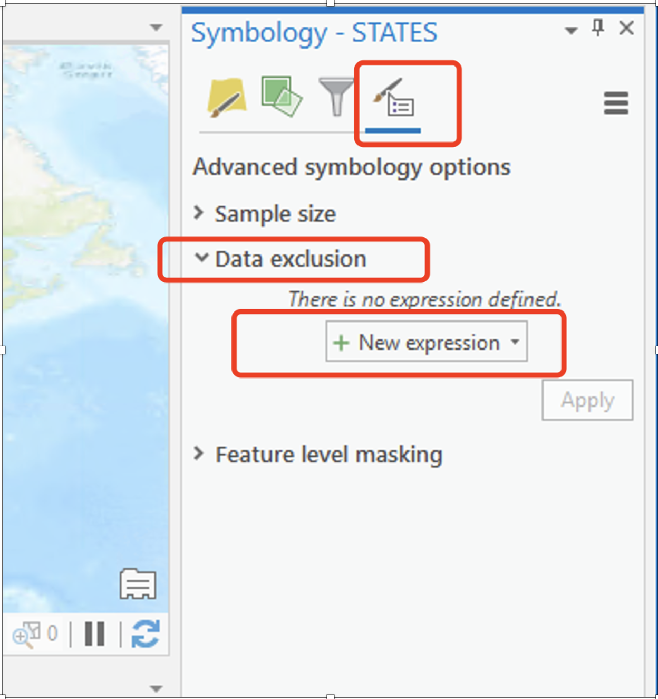

  
```{r setup, include=FALSE}
knitr::opts_knit$set(base.dir = "./labs/", root.dir = "./labs/")
knitr::opts_chunk$set(echo = TRUE, eval = FALSE)
```
---

**Due Date:**

**Instructor: Xiaozhong Sun (xs243@cornell.edu)**

**Lab TAs:**

**Location: Sibley 305, Barclay Gibbs Jones Computer Lab**

**Total Points:**

---

## Goals for this lab

Today's lab has two parts: 

1. Selecting features
2. **Thematic Mapping**

After today's lab, you will be able to select and export features in varies ways; making thematic map showing patterns or distributions of variables of interests.

---

## Know your data

For today's lab, we will use a 2010 U.S. Census County boundary layer and a 2010 U.S. Census State boundary layer.

---

## Selecting Features

Now we will learn how to select features in ArcGIS. Selecting features are very handy when you want to edit GIS data. If you are doing an operation that includes editing or extracting a specific feature within a shapefile, you will likely need to Select that feature. 

There are several ways for you to select a feature.

<br>

### Selecting through attribute table

Right click on the **STATES** layer and select **Open Attribute Table**. Right click on column header for the **“STATE_NAME”** column, choose **Sort Ascending**. Click in the “left bar” of the row that contains New York (FID 15). See Figure below. Clicking in this area selects the feature. If you look at the map pane in your window, notice that the border of New York State is highlighted with the same color as it was highlighted in the attribute table (fluorescent blue). You can also select multiple rows by holding shift key.

<left></left>

Back in the Attribute Table window, right click on the left bar of the selected state (New York) in the attribute table. Click **Zoom To**. This zooms the display to the extent of the feature, in this case, New York State. You may also do this through the **Navigate** Group's **Zoom to selected features**.

*	Note that if County layer is listed above State layer in your Layers pane (which is likely, since they are in alphabetical order in your directory) you will see the outlines of US counties within the highlighted area of New York State. This is somewhat misleading, because the selection is not done in the County layer. In your Layers pane, toggle on and off the Counties and States layers to see what happens. Make sure the layer of feature selected is on the top of your layer pane to aviod confusion.

Now let's export the feature we just select. We will create a new shapefile of New York State. Sometimes, creating new layers limited to your study area minimizes the RAM, or memory required for processing. Extracting the study area (as this procedure is often called) is a necessary step of preparing data for GIS analysis.   
 
With New York State selected, right-click on the **States** layer in the table of contents, choose **Data** and click **Export features**. 

<left></left>

A **Export Features** dialog box should appear. Choose an output location at your local drive where you store your lab_2 data. Give the output the name **nystate**. This tool creates a new layer only of the selected features. Click OK. You will see that a new layer, **nystate**, is added to the table of contents and a layer of only NY State is added to the view. 

Now remember to	click **Clear Selected Features** under the **Selection** group. This un-select any features you have selected. This is important, because it prevents you from doing operations on features you don’t intend to alter. 

Change the symbology of nystate so that it has no fill and a slightly thicker border than the counties borders.  

<br>

### Selecting through functions under the Selection group

Now let's use the newly exported layer to practice other selection functions. 

You can also select features through functions within the **Selection** group. There are mainly two functions: **Selecting features by attribute/Querying the data** and **Selecting by Location**.

<left></left>

- Note that you can also select features using the **Select Features tooltip**<left></left> under the **Selection** group and deselect by clicking on white space in the Map pane. To select a feature this way, click on the tooltip to activate it, then click on the feature you wish to Select. Play around with this. When you are done, clear selections.

Under Selection group, click **Select By Location**. We are going to select all the counties that are contained in New York State. In the **Select Layer By Location** dialogue box. Select **COUNTIES** as the **input feature**, **Within** as the **relationship**. And **nystate** as the selecting feature. Click Apply and OK. 

<left></left>

Now let's check the results. Right Click on the Counties layer, choose Open Attribute Table. In the lower left portion of the table frame, click the on the **Show selected records** icon. This filters the table selected features. You can see that all counties of New York state are selected. 

Now let's repeat the export process, this time for all the counties within NYS. Right Click on the Counties layer in the table of contents, choose Data and click Export Features as we did above. Name the new layer **nycounties**.

- As a point of comparison, you can explore different select by location relationships (for example, try selecting counties that are ‘completely within’ New York State. You will note that this produces a slightly different selection pattern). You can also use using search distance measurements.

Clear Selected Features. Change the symbology of nycounties so to have no fill and a thinner border than the nystate border. Turn off the original STATES and COUNTIES layer – we will no longer need these for this analysis.

Now let's practice how to select through query table. We will run a query to find the number of counties with a population greater than 300,000. To do this, we will use the **Select by Attributes** option from the **Selection** group. The dialogue box uses SQL (structured query language) syntax, which is what many databases (even non-spatial) databases are built with.

In the dialogue box, select **nycounties** for the input and **New selection** for the selection type. Notice the **Where** clause. A “WHERE clause” is part of a SQL SELECT statement that specifies which rows to select.

Create the following expression: Where POP2010 is greater than 300000. Click Run and close the dialog box. Both the attribute table and the shapefile for “nycounties” should now indicate 14 counties selected.  

<left></left>

Open the Attribute Table and click the ‘Show selected records’ as we did before. This helps you identify the names of selected counties. Export the selected counties and create a new shapefile of NY counties with a population greater than 300,000. Under the options menu in the attribute table, clear the selection and close the attribute table.

Now save your project! We are about to open a new project.

---

## Thematic Mapping and Classification

You will now create a series of **thematic map layouts** that use different data classification schemes to depict population density (Population per square mile, POP10_SQMI) in New York State, based on 2010 Census data. 

Please note that you are required to make a proper **layout** of each classification method, which means you need to include all the necessary elements of map layouts (As for whether to include a context map, you decide)! This is the time you practice what you have learned in Lab_1. However, as these layouts are all fairly similar, you can create and reuse a single layout for each of them. You can either start a new project and import the shapefiles you just saved or you can continue with the same project.

<br>

### **Map 1** 
Create a map layout showing the counties in NYS that have a 2010 population of more than 300,000.

<br>

### **Map 2** 

Create a map layout using Natural Breaks classification.

Steps:

1.	In the table of contents, right click on the layer name **nycounties** and select **Symbology** tab. Under **Primary Symbology** select **Graduated colors**.

<left></left>

2.	Select “POP10_SQMI” as the field.  (“POP10_SQMI” represents population density of 2010, measured in population of 2010 per square mile.)
3.	Based on the population density classification field, use the default Classification of Natural Breaks (Jenks). You can experiment with the number of classes and settle on which one you find appropriate. Note that we did not use “normalization.” We will explore this later in the lab. Next, select an appropriate color scheme (Generally monochromatic works well for the given data range). 
4.	Under **Advanced Symbol Options**<left></left>, you can adjust the decimal places of numbers under **Label**, normally we leave two decimal places. This is a important step formatting your legend.
5.	Close the dialog box when you are satisfied with your creation.

<br>

### **Map 3** 

Follow the same procedure as for Map 2, but use the equal interval classification method and create a new layout with all the appropriate elements.

When you change your classification, click on the **Histogram** tab and notice how the data classification intervals differ. This time, the majority of the counties fall into the lowest category. As you can see, the default is 5 groups or classes. Experiment with the number of classes and settle on which one you find appropriate.

<left></left>

If you are unhappy with the color schemes available in ArMap, you can make your own and save it. The [Colorbrewer](https://colorbrewer2.org/#type=sequential&scheme=BuGn&n=3) website is helpful for selecting colors for graduated and categorized maps.

Also, note that you can manually change the position of the bars of the **Histogram** by clicking and dragging them (if you wanted to create a custom or user defined classification). Notice that as soon as you drag one of the triangles, the **Method** switches to **Manual Interval**. 

- Note: categorization is for display purposes only – it does not alter the underlying continuous data set. If we had 62 classes (one for each county), it would be very hard for the eye to distinguish between classes. The human eye can only decipher at most 6-8 categories.

<br>

### **Map 4** 

Follow the same procedure but use the **quantile** classification method and create a new layout with all the appropriate elements. Experiment with the number of classes and settle on one you find appropriate. As you toggle between the different classification methods, please take a moment to notice the effect on the summary statistics, histogram, bars and break values. 

<br>

### **Map 5** 

Follow the same procedure but use the **standard deviation** classification method and create a new layout with all the appropriate elements. Experiment with the number of classes and settle on one you find appropriate.

>**Question 1: Briefly discuss some of the basic differences in patterns based on classification schemes. Which classification method in this case do you feel provides a better representation of population density? Provide a brief discussion of your reasoning.**

<br>

### **Map 6** 

Now let's explore normalizing data. When presenting data, particularly for spatial units such as political or administrative boundaries, researchers will often want to normalize the data, rather than present the raw number. As you know from your stats class, one way to accomplish this is by dividing each value by a total, converting the raw data into a proportion/percentage. Another way is to divide it by another variable, which converts the raw data into a ratio variable. By using a population density variable, we already explored one type of normalized data. Now let’s explore some others.

Turn off the **nystate** and **nycounties** layers and turn back on the **STATES** and **COUNTIES** layers. Right click the layer **STATES**. In the **Symbology** tab, select **Graduated colors**. Under the **Field**: menu, select **BLACK**. This displays the total African American population for 2010 by state. Note the pattern – states with high populations tend to have a lot of African American people.

Now under the **normalization** menu, select ‘**POP2010**’ – notice the change in the pattern. Note that we have ratios instead of absolute population in the “Label” columns. Experiment with the number of classes and the classification method.
 
We can change the ratio to a percentage. Click on the **Advanced Symbol options**. Under **Category**, select **percentage.** Check the box ‘Numbers represent a fraction’ and reduce the decimal places to 2 (see box below). This will give you a more straightforward classification that’s easier to interpret.

<left></left>

Now create a map layout of normalized Black population by State (Only Continental US).

<br>

### **Map 7** 

Create a multivariate map layout depicting normalized Black and Hispanic population together.

Multivariate thematic maps are extremely useful finding spatial relationships. Let’s explore that relationship use your normalized layer of African Americans to see if there is a relationship with Hispanic population. 

Right now, you should have your normalized black population map showing. Copy and paste your states layer within the table of contents (so, you should have 2 states layers at this point!). Make sure your new STATES layer is on top. Give it another name like State_Hisp_Pop.

This time, create a **graduated symbol map** (**not graduated color map**) of the population Hispanic, normalized by the 2010 population. Adjust the colors and the size as you see fit. Your map should look like the figure below.

<left></left>

>**Question 2: Is there a spatial relationship between Black and Hispanic populations? Briefly explain.**

<br>

### **Map 8** 

Now let's learn to deal with extreme values/outliers. Extreme values sometimes are bad for making thematic map since they will affect our classification and mask more useful and important information we try to convey. Therefore, we want to take a note (this is important!) and exclude them before making our maps.

Using **STATES** layer, create a **proportional symbol map** of US states using the field POP10_SQMI using any particular classification scheme you would like. What happened? 

Washington DC has a very high population density and is throwing the classification off quite a bit. To confirm this, we will undertake some exploratory spatial data analysis.

Under the **Feature** layer tab, select **Data-> Visualize -> Create Chart**.

<left></left>
  
Some additional tools become apparent, under **Create Chart**, go to **QQplot**. In the **Chart Properties**, under the **Variables** tab, select **compare the distribution of POP10_SQMI**.

<left></left>

You will see the distribution of population density by state. Highlight the outlier (just click on the dot, also a new way to select a feature) in the upper right - Washington DC. Note how much the inclusion of DC is throwing the distribution off – the next highest value (New Jersey) is below the line that represents a ‘normal’ distribution.

<left></left>

You can also check the outlier using **Histogram** under **Create Chart**. Select POP10_SQMI as the Number. A histogram should appear at the bottom with a chart properties box that contains some additional summary statistics. Washington DC lies far to the right, so much so that most of the other states fall into a single category. Note the **Chart Properties** box. Let's recap some basic statistics that describe a distribution.

<left></left>

Skewness is a measure of the symmetry of a distribution.

1.	For symmetric distributions, the coefficient of skewness is zero. 
2.	If a distribution has a long right tail of large values (i.e., Washington DC), it is positively skewed. 
3.	If it has a long-left tail of small values, it is negatively skewed. 
4.	In addition, note that the mean (384) is larger than the median (101), also indicating a positively skewed distribution (the opposite would be true for a negatively skewed distribution). 

[Kurtosis](https://www.itl.nist.gov/div898/handbook/eda/section3/eda35b.htm) is a measure of whether the data are heavy-tailed or light-tailed relative to a normal distribution. That is, data sets with high kurtosis tend to have heavy tails, or outliers. Data sets with low kurtosis tend to have light tails, or lack of outliers. Normal distributions produce a kurtosis statistic of about zero. 

Clearly, we can and should exclude Washington DC to create a more sensible classification. 

Let’s build a query to do so using SQL. 

*	In the **symbology** dialog box, go to **Advanced Symbol options**, and open **Data Exclusion**.

<left></left>

*	Add an **expression (+ New expression)** and complete the **Where** clause that will exclude the District of Columbia. 

There are multiple ways to exclude DC, e.g., you can set **"Where"** to **"STATENAME"** and **"is equal to”** DC’s name.

<left></left>

Or set **"Where” = POP 10_SQMI, and “is equal to” the value of DC’s POP10 density**, which is the highest in the drop-down menu, or set **"Where" = POP 10_SQMI, and “is greater than”** that of DC’s density. Try them all or develop your own SQL. 

<left></left>

<left></left>

Then click Apply and look at the resulting effect on your classification.

<left></left>

- Note: we haven’t removed DC from the data set, we are just excluding it from the map layout. Look at the updated QQ plot or histogram, see how the new plot looks different (the outlier is gone)

Now make a population density map layout using graduated colors by state exclude D.C.

---

## Now it's your turn!!!

Here is your second assignment. (Total points 100 + 10)

In the first part of assignment (90 points), just finish **Map 1 - 8** and answer **Question 1-2** follow our lab instructions. These maps are 10 points each, and questions are 5 points each.

For the second part of the assignment:

1. Map 9 (10 points): create a multiple attributes map layouts of New York State counties displaying the % of housing units which are renter occupied (RENTER_OCC) (normalized to the total number of housing units: HSE
_UNITS) and the % population that has never been married, using “NMARRY00” (already normalized). Write a short answer to the following questions: Justify your choice of classification scheme (why you use this scheme); Discuss any spatial patterns you may notice. Is there a spatial relationship between these two variables? 

2. Map 10 (Bonus 10 points): Create a Multivariate map layouts depicting number of electoral votes (EV_2012) and winning party (Party_2012) by state for the continental US for 2012 election. 

Hint: electoral votes (continuous variable) should be displayed using graduated symbols. And you can use color to classify winning party since it is nominal/categorical data. 

<br>
<br>

**The END**