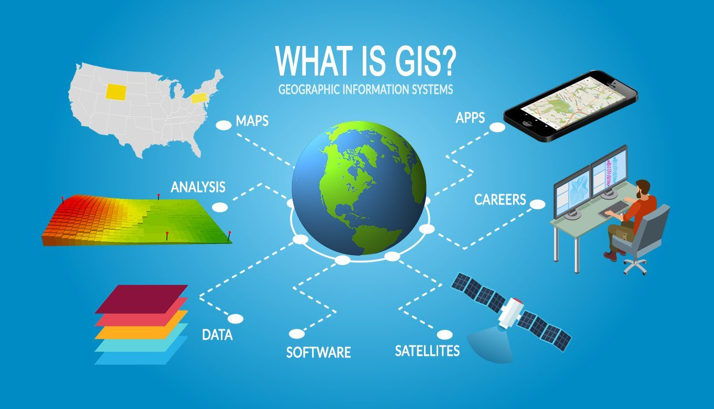

**CRP 4080**

**Introduction to GIS for Planners**

**Cornell University, Fall 2022**

[Image source](https://gisgeography.com/what-gis-geographic-information-systems/)

***

#### Course Info  

[Canvas Site](https://canvas.cornell.edu/courses/39033)

**Lectures Time**:  TBD

**Lab Sessions**: TBD

**Instructor**:

**TA**: 

**Office hours**: 

**Grading**: 

***

#### Course description

  

***

#### Learning outcomes

By the end of this course, students will be able to:

* Feel comfortable working within the GIS environment and be familiar with a range of available tools and methods to address planning related problems and issues.
*	Independently apply appropriate GIS techniques to analyze and think critically about complex urban and regional issues; and use online resources and software documentation to learn new GIS techniques when necessary.
*	Create original knowledge regarding urban and regional issues using GIS methodologies.
*	Communicate spatial information effectively using maps (visual communication) and connect visual communication to expository writing and argumentation.
*	Examine and be able to apply spatial statistical and qualitative knowledge of urban and regional issues.
*	Produce and interpret maps and other forms of spatial information found in professional planning reports, research articles, news media, and public forums. 

***

#### Prerequisites
 

***

#### Course format

 

***

#### Evaluation

***

#### Course materials

***

#### Code of conduct

We are dedicated to providing a welcoming and supportive environment for everyone, regardless of background, identity and prior experience level. Everyone in this course will be coming from a different place with different experiences and expectations. We will not tolerate any form of language or behavior used to exclude, intimidate, or cause discomfort. This applies to all course participants (instructor, students, guests). In order to foster a positive and professional learning environment, we encourage the following kinds of behaviors:

* Use welcoming and inclusive language
* Be respectful of different viewpoints and experiences
* Gracefully accept constructive criticism
* Show courtesy and respect towards others
* Help each other - you may well learn something or reinforce your own skills in the process

***

#### Student accommodations  

In compliance with the Cornell University policy and equal access laws, we are available to discuss appropriate academic accommodations that may be required for student with disabilities. Requests for academic accommodations are to be made during the first two weeks of the course, except for unusual circumstances, so arrangements can be made. Students are encouraged to register with Student Disability Services to verify their eligibility for appropriate accommodations.

***

#### Tentative schedule  

*Subject to change*  

